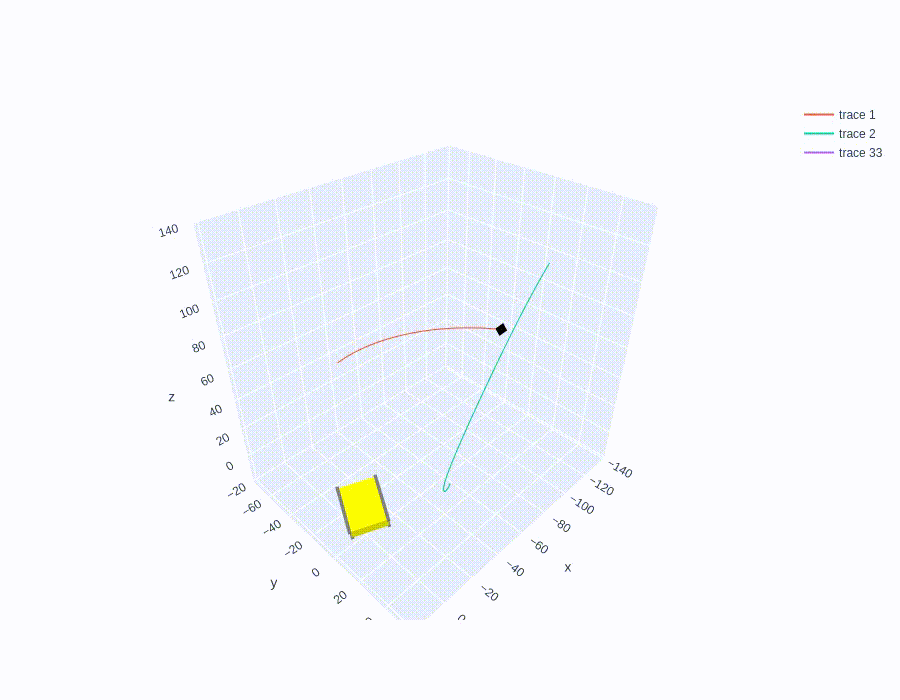

# Python-проект для аспирантского диплома
| Тема дипломной работы | Определение относительного движения космических аппаратов в групповом полёте |
|-----------------------|------------------------------------------------------------------------------|
| Кафедра               | Математического моделирования и прикладной математики                        |
| Физтех-школа          | Прикладной Математики и Информатики (ФПМИ)                                   |

 "Помнишь, я тебе говорила про мусор, который стоит? Стоит и смердит? Так вот — это была метафора. Я имела в виду тебя."

---

#### Способы основного численного моделирования:
- v.DYNAMIC_MODEL = 'rk4': НОО, e=0
- v.DYNAMIC_MODEL = 'kiamastro': ИСК полное моделирование, переход в ОСК при любом e, i

---
Пока что задача на этапе НОО: 

Плохой пример обнаружения чипсата только по оценке расстояния:

#### Основная часть проекта расположена в каталоге _srs/kiamfemtosat_:
| main             | Запуск численного интегрирования                                                                            |
|------------------|-------------------------------------------------------------------------------------------------------------|
| config           | Экспресс-настройка параметров                                                                               |
| cosmetic         | Вывод и отображение                                                                                         |
| dynamics         | Класс и функции численного моделирования                                                                    |
| extra simulation | Неосновное численное моделирование. Построение графиков                                                     |
| gnc systems      | Guidance, Navigation & Control                                                                              |
| my math          | Мини-функции разных областей (округов, резиденций; они развязали великую войну, приведшую к великой скорби) |
| my plot          | Функции построения результатов основного численного моделирования                                           |
| primary info     | Комплекс первичной информации                                                                               |
| spacecraft       | Классы материнских и дочерних аппаратов в рое                                                               |
